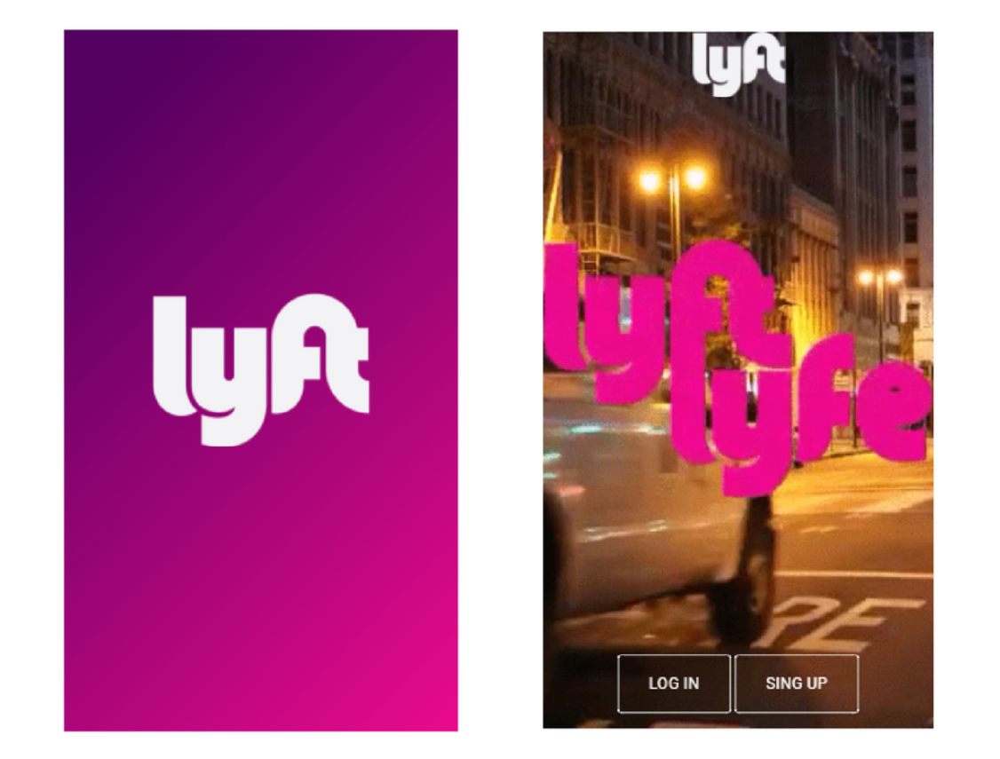
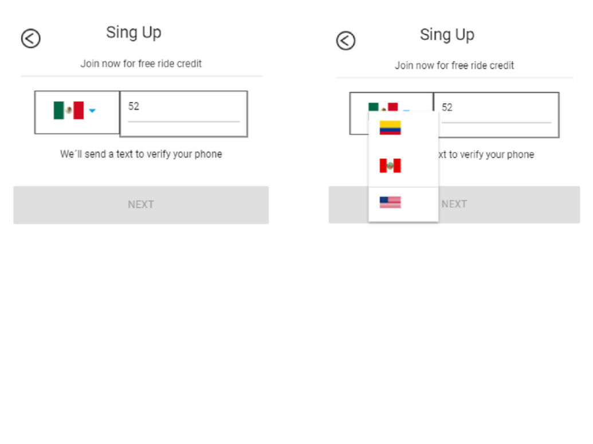
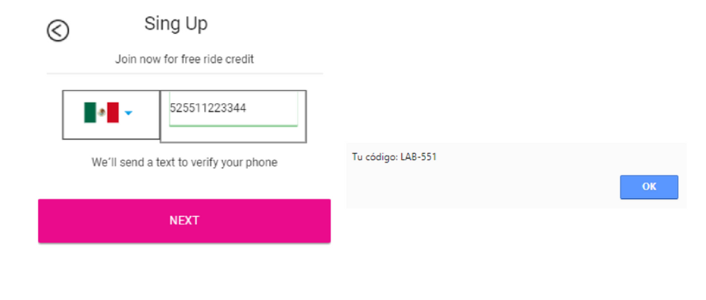
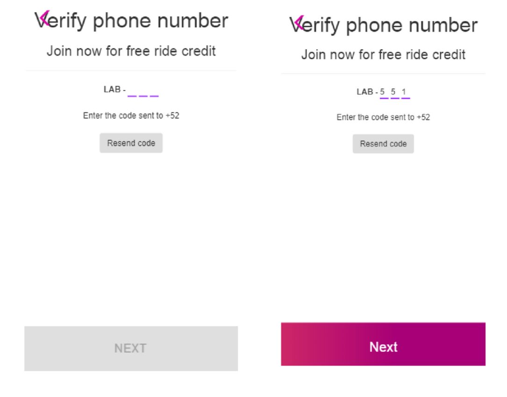
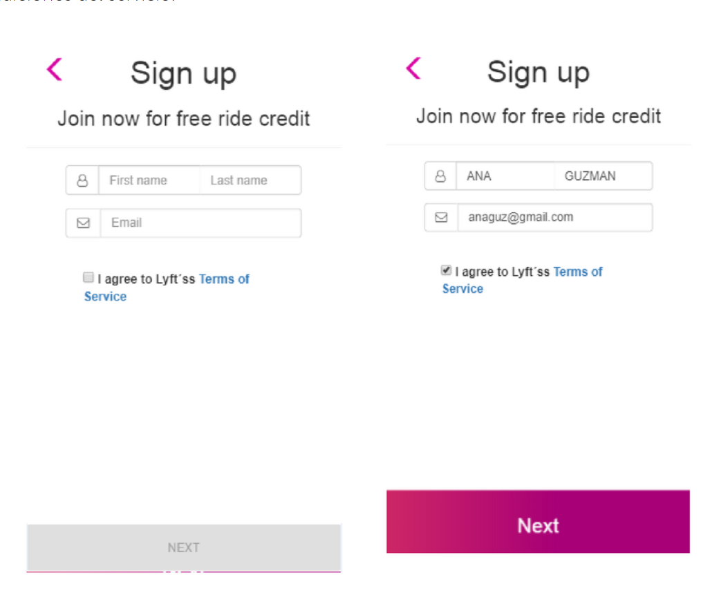
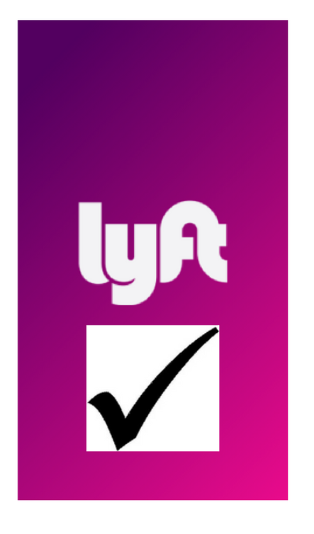

# **Lyft Móvil**

En esta oportunidad nos piden replicar Lyft y estos son los objetivos:

#### Splash 

Splash de 2 a 5 segundos en donde se encuentran dos botones que es `sing up` o `Loging`

#### Inicio
Para este reto ingresaremos al flujo `Sing Up` y harémos validar a travez de JS al momento de elegir un país y el número.

## **Sing Up**
Aquí habiendo ingresado su número hará click a "next" y nos traeráa un código.

## **Verificando**
Aquí ingresaremos el código entregado anteriormente para así habilitar el botón "Next"

## **Sing Up2**
Siguiendo para que se registre y habilitando el boton 

## **Aprobación**
Aquí aprueba su registro

